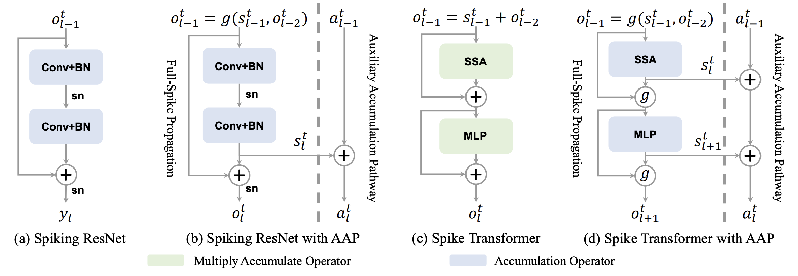

# Training Full Spike Neural Networks via Auxiliary Accumulation Pathway

## Introduction

This repository contains the official PyTorch implementation of the following paper:

> [**Training Full Spike Neural Networks via Auxiliary Accumulation Pathway**](https://arxiv.org/abs/2301.11929),  
> [Guangyao Chen](https://icgy96.github.io/), [Peixi Peng](https://scholar.google.com/citations?user=CFMuFGoAAAAJ&hl=it), [Guoqi Li](https://scholar.google.com/citations?hl=it&user=qCfE--MAAAAJ), [Yonghong Tian](https://www.pkuml.org/)
> [[arXiv](https://arxiv.org/abs/2301.11929)][[Bibtex](https://github.com/iCGY96/AAP#citation)]



## Updates

- [05/2023] Code are released.

## Dependency

We suggest to use anaconda install all packages.

Install `torch>=1.5.0` by referring to:

https://pytorch.org/get-started/previous-versions/

Install `tensorboard`:

```shell
pip install tensorboard
```

The origin codes uses a specific SpikingJelly. To maximize reproducibility, the user can download the latest SpikingJelly and rollback to the version that we used to train:

```bash
git clone https://github.com/fangwei123456/spikingjelly.git
cd spikingjelly
git reset --hard 2958519df84ad77c316c6e6fbfac96fb2e5f59a3
python setup.py install
```

# Running Examples

### Train on ImageNet

```bash
cd imagenet
```

Train the FSNN-18 (AAP) with 8 GPUs:

```bash
python -m torch.distributed.launch --nproc_per_node=8 --use_env train.py --cos_lr_T 320 --model dsnn18 -b 64 --output-dir ./logs --tb --print-freq 500 --amp --cache-dataset --connect_f OR --T 4 --lr 0.1 --epoch 320 --data-path /datasets/imagenet
```

## Citation

If you find our work useful for your research, please consider giving a star :star: and citation :beer::

```bibtex
@article{chen2023training,
  title={Training Full Spike Neural Networks via Auxiliary Accumulation Pathway},
  author={Chen, Guangyao and Peng, Peixi and Li, Guoqi and Tian, Yonghong},
  journal={arXiv preprint arXiv:2301.11929},
  year={2023}
}
```

## Acknowledgement

This code is built using the [spikingjelly](https://github.com/fangwei123456/spikingjelly) framework, the [syops-counter](https://github.com/iCGY96/syops-counter) tool and the [Spike-Element-Wise-ResNet](https://github.com/fangwei123456/Spike-Element-Wise-ResNet) repository.